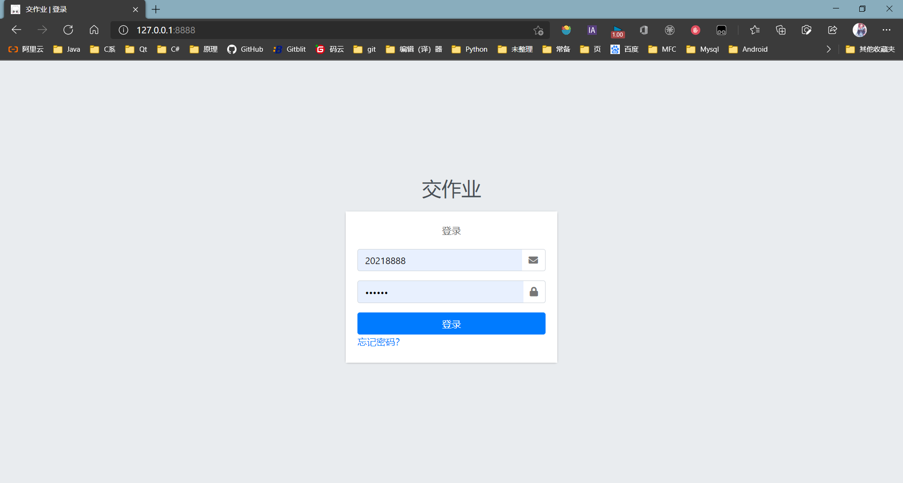
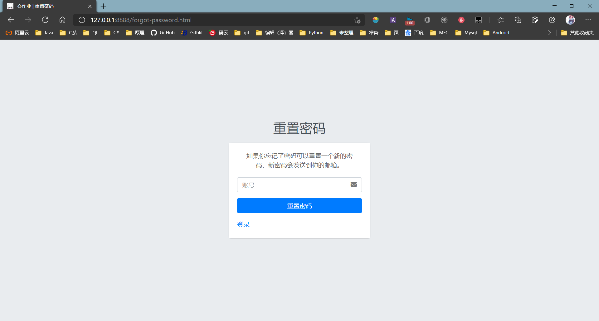
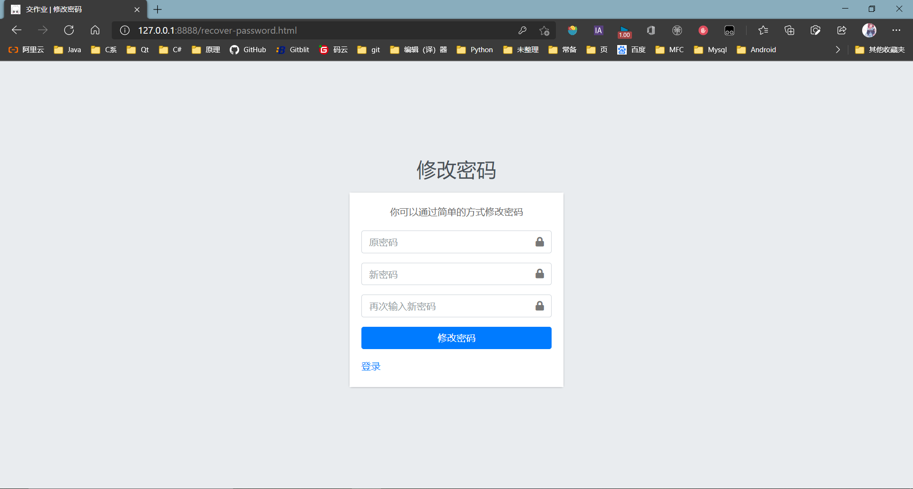
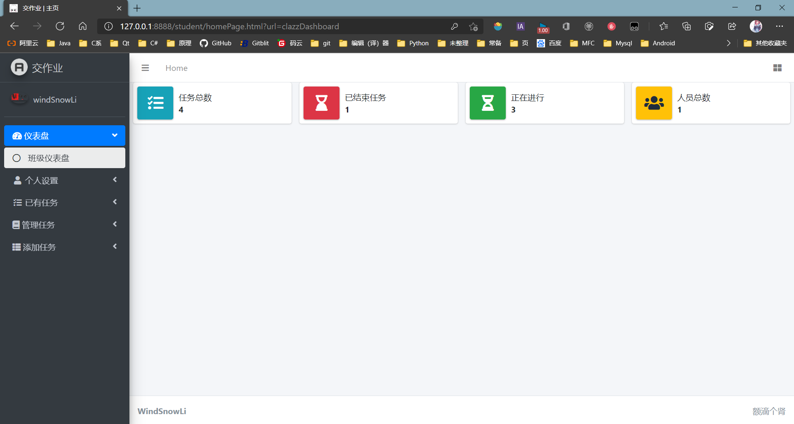
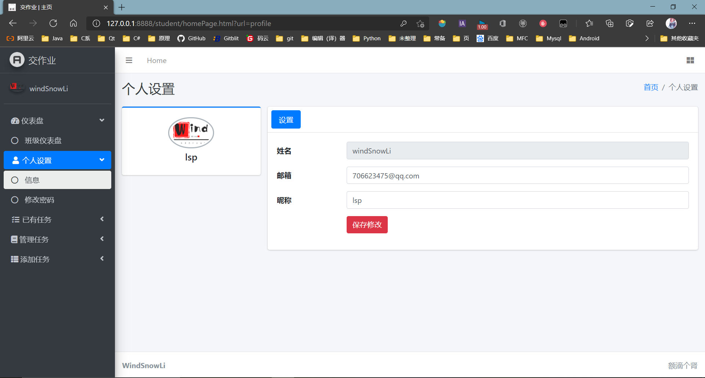
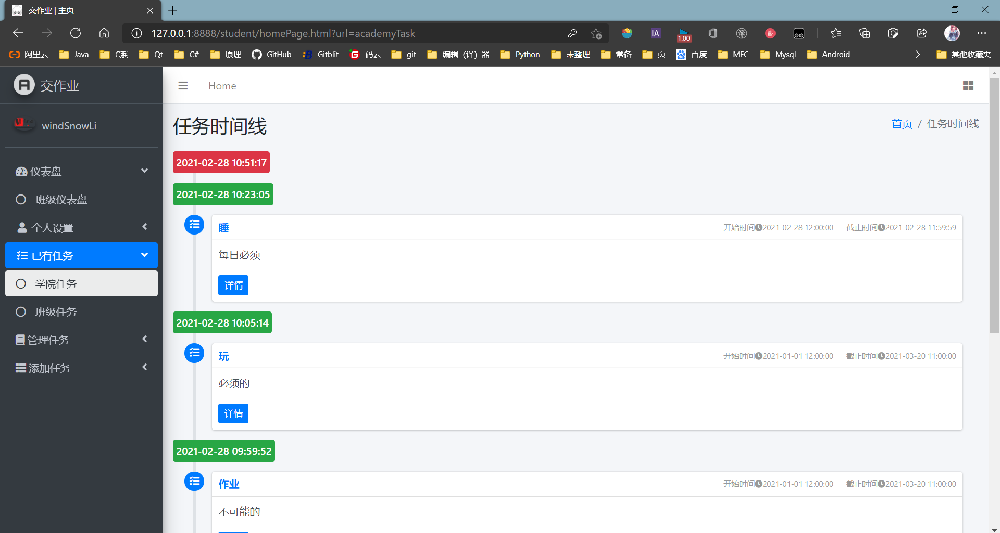
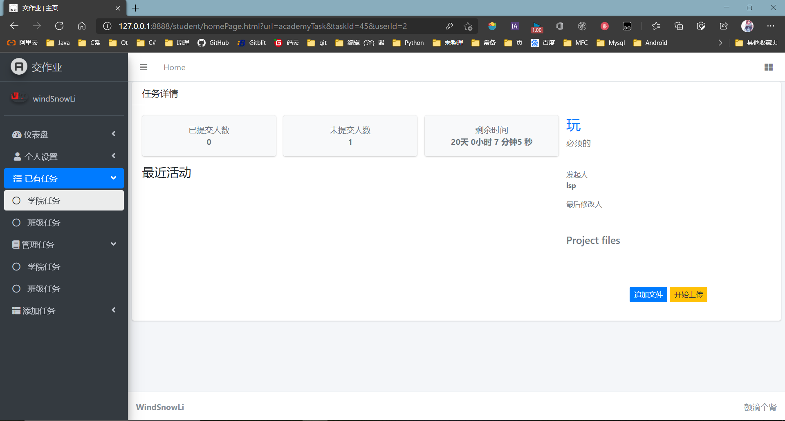
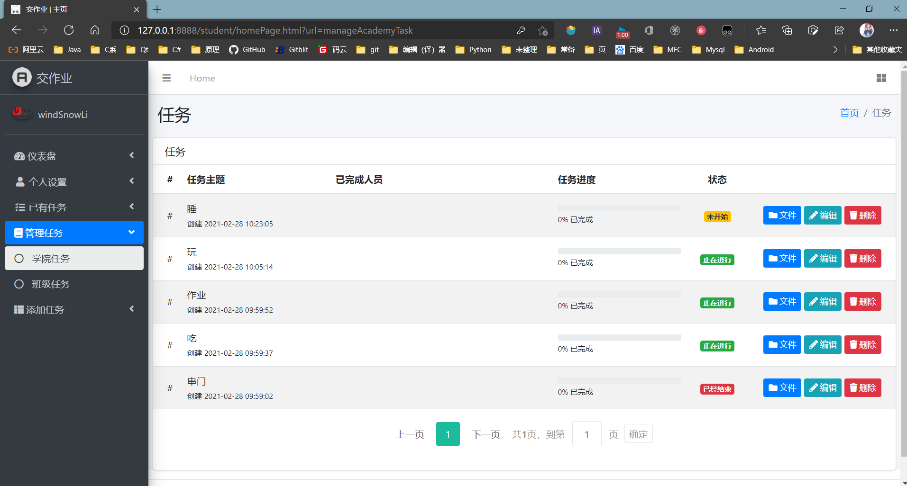
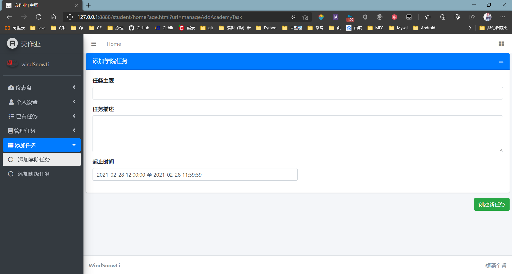

# 用于管理交作业前后端分离的一个小项目

## 简介

一个后端渣渣前端沫沫的假期无聊找的乐子，用以帮助收作业（不想被催）所作。前端基本一团乱麻，后端基本豆腐渣。目的貌似也没达到。

## 关于使用

1. html为前端文件，manage-task为后端spring boot项目
2. 前端js/myjs/work.js中的第一个 `` `getUrl()` ``函数返回值为后端服务地址
3. 密码获取方式为  ```MD5(SHA512(原始密码+盐))```，原始密码+盐取SHA512再取结果的MD5。 例如原始账号```20218888```，原始密码```20218888```，盐```20218888``` ,密码为```b8d9bcc536b2a769db391ba24fa60111```
4. 数据库sql文件在sql文件夹，需先创建数据库managework

## 相关技术

### 后端

    1. jdk11
    2. spring boot
    3. mysql8.0+
    4. druid数据库连接池
    5. mybatis
    6. oss（使用的aliyun）
    7. IDEA编译器
    8. Lombox插件

### 前端

    1. 使用nginx或者httpd服务
    2. 使用html、js、jQuery、AdminLTE-3.0.5
    4. FileSaver.js-2.0.4
    5. plupload-2.1.2
    6. ......貌似没可说的了

## 相关界面

### （一览无余）登录



### （通俗易懂）密码重置



### （简单方便）修改密码



### （一片白板）单调的仪表盘



### （隐私极少）个人设置



### （不大好看）已有任务时间线



### （尚且能看）已有任务提交详情



### （略显简单）任务管理界面



### （简朴穷酸）添加任务界面


